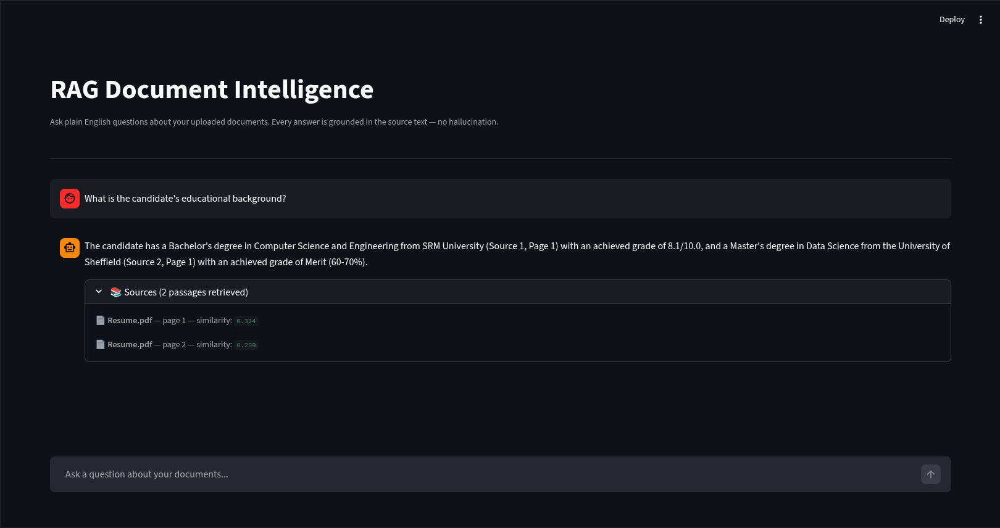
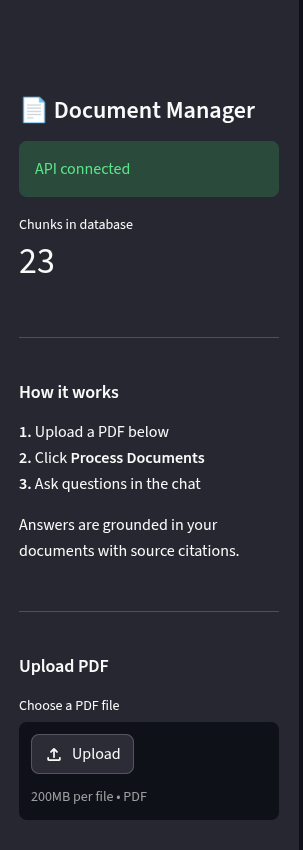

# RAG Document Intelligence System


A full-stack Retrieval-Augmented Generation (RAG) system that lets users
upload PDF documents and ask plain English questions about them, receiving
accurate answers with source citations — powered entirely by local AI with
no external API dependencies.

---

## Demo


*Asking questions about uploaded documents with cited answers*


*Document upload and management interface*

---

## What This Does

Traditional search finds documents containing your keywords. This system
understands the *meaning* of your question and retrieves the most relevant
passages — even if they use completely different words. It then passes those
passages to a local LLM which reads them and writes a coherent, cited answer.

The entire pipeline runs locally — no data ever leaves your machine.

---

## Architecture

```
┌─────────────────────────────────────────────────────────┐
│                    INDEXING (once)                       │
│  PDF → Text → Chunks → Embeddings → PostgreSQL/pgvector │
└─────────────────────────────────────────────────────────┘

┌─────────────────────────────────────────────────────────┐
│                   QUERYING (per question)                │
│  Question → Embed → Vector Search → LLM → Cited Answer  │
└─────────────────────────────────────────────────────────┘

┌──────────┐     ┌─────────────┐     ┌──────────────────┐
│Streamlit │────▶│   FastAPI   │────▶│ PostgreSQL       │
│  :8501   │     │   :8000     │     │ + pgvector :5432 │
└──────────┘     └──────┬──────┘     └──────────────────┘
                        │
                 ┌──────▼──────┐
                 │   Ollama    │
                 │  LLaMA 3.1  │
                 └─────────────┘
```

---

## Tech Stack

| Tool | Purpose | Why |
|---|---|---|
| Python 3.13 | Core language | Modern, type-safe |
| PostgreSQL + pgvector | Vector storage & similarity search | Production-grade, SQL knowledge transferable |
| sentence-transformers (all-mpnet-base-v2) | Text embeddings | 768-dim vectors, runs on GPU locally |
| LangChain | Text chunking | Industry standard, smart section-aware splitting |
| Ollama + LLaMA 3.1 | Local LLM inference | No API costs, full privacy, GPU accelerated |
| FastAPI | REST API backend | Auto-docs, Pydantic validation, async support |
| Streamlit | Frontend UI | Rapid Python-native web app |
| Docker Compose | Containerisation | One-command deployment, reproducible environment |

---

## Quick Start

### Prerequisites
- Docker and Docker Compose
- Ollama with LLaMA 3.1 (`ollama pull llama3.1`)

### Run

```bash
# clone the repo
git clone https://github.com/Veenkatacharan/RAG-Document-Intelligence
cd RAG-Document-Intelligence

# start ollama
ollama serve &

# start all services
docker compose up --build
```

Open `http://localhost:8501` in your browser.

### Usage

1. Upload a PDF using the sidebar
2. Click **Process Documents** to index it
3. Ask questions in the chat interface
4. Expand **Sources** under any answer to see citations

---

## Project Structure

```
rag-document-intelligence/
├── ingestion/
│   ├── loader.py          # PDF text extraction (PyMuPDF)
│   ├── chunker.py         # Section-aware text chunking
│   └── embedder.py        # GPU-accelerated embeddings
├── database/
│   └── vector_store.py    # pgvector storage and similarity search
├── api/
│   └── main.py            # FastAPI endpoints
├── ui/
│   └── app.py             # Streamlit chat interface
├── rag_pipeline.py        # End-to-end RAG orchestration
├── init.sql               # Database schema
├── Dockerfile             # API container
├── Dockerfile.ui          # UI container
├── docker-compose.yml     # Multi-service orchestration
└── screenshots/           # UI screenshots
```

---

## How It Works

### Indexing Pipeline
1. **Load** — PyMuPDF extracts text from PDFs page by page
2. **Chunk** — A section-aware splitter detects structural boundaries (headings, list sections) and keeps related content together, falling back to character splitting for large sections
3. **Embed** — `all-mpnet-base-v2` converts each chunk into a 768-dimensional vector capturing semantic meaning, running on GPU via CUDA
4. **Store** — Vectors and text are stored in PostgreSQL with the pgvector extension

### Query Pipeline
1. **Embed question** — the question is embedded using the same model
2. **Similarity search** — pgvector finds the top-k chunks by cosine similarity
3. **Generate** — retrieved chunks are passed to LLaMA 3.1 via Ollama with a strict prompt instructing it to answer only from the provided context
4. **Cite** — sources and page numbers are extracted and returned alongside the answer

---

## Key Design Decisions

**Why section-aware chunking?** Pure character-based chunking fragments structured documents — headings end up separated from their content. The custom chunker detects section boundaries first, preserving document structure.

**Why local LLM?** Running LLaMA 3.1 via Ollama means zero API costs during development, no data privacy concerns, and demonstrates understanding of the full stack beyond just API calls.

**Why PostgreSQL over dedicated vector databases?** pgvector brings vector search to a familiar, production-proven database. This keeps the stack simple and shows SQL knowledge — most companies already run PostgreSQL.

---

## Author

Veenkatacharan Manne Muddhu Sridhar
MSc Data Science — University of Sheffield
[LinkedIn](https://www.linkedin.com/in/veenkatacharan-manne-muddhu-sridhar-3455ab1a4/) | [Email](mailto:veenkata2002@gmail.com)
